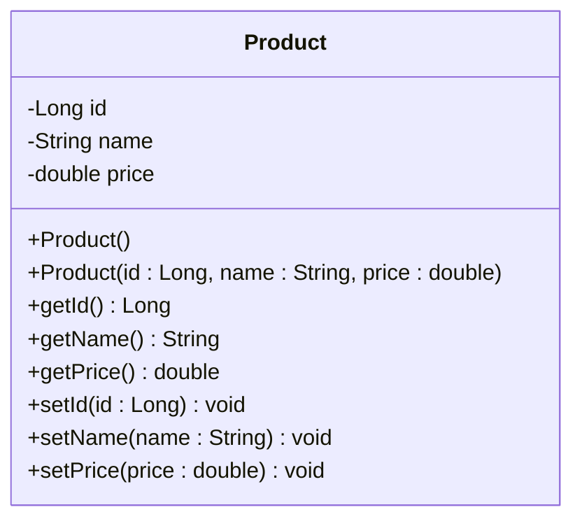

# Product UML Class Diagram

```mermaid
classDiagram
    class Product {
        -Long id
        -String name
        -double price
        +Product()
        +Product(id : Long, name : String, price : double)
        +getId() Long
        +getName() String
        +getPrice() double
        +setId(id : Long) void
        +setName(name : String) void
        +setPrice(price : double) void
    }
```

Note: setters are included because the supplied starter project already has them.
